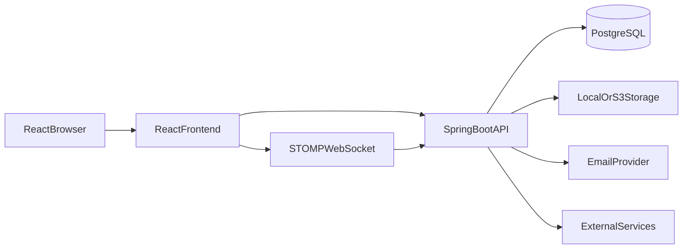
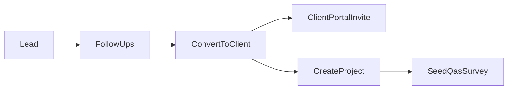
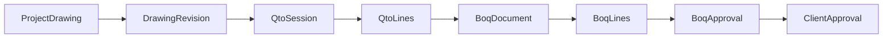
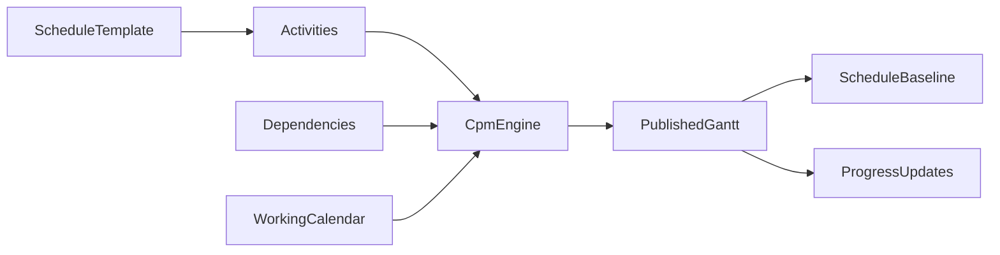
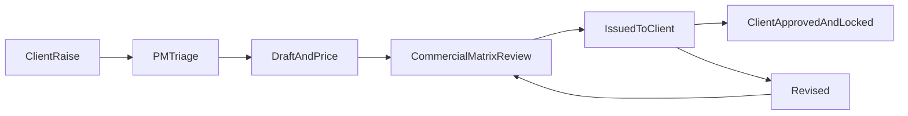
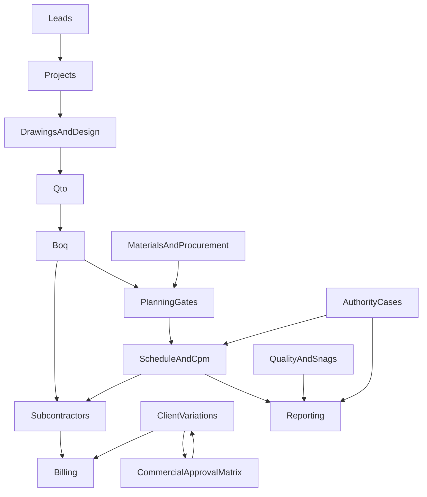

# JCT Fit-Outs — Project Overview

## 1. What this project is

JCT Fit-Outs is a multi-tenant SaaS platform for managing interior fit-out and construction projects from lead generation through design, BOQ approval, planning, execution, quality, commercial control, billing, and subcontractor collaboration.

The workspace contains two applications:

- `Fit-Outs-Backend` — Spring Boot REST/WebSocket API.
- `fit-outs-frontend-` — React role-based web application.

The system is designed around a shared PostgreSQL database. Every tenant/company owns its users and project data, and backend services use company context to prevent cross-tenant access.

## 2. High-level architecture



### Backend stack

- Java 21.
- Spring Boot 3.5.
- Spring MVC and Spring Security.
- Spring Data JPA / Hibernate.
- PostgreSQL.
- Flyway migrations.
- Spring Session JDBC.
- Lombok.
- STOMP/WebSocket messaging.
- Optional S3 storage.
- Swagger/OpenAPI.

### Frontend stack

- React 19.
- Create React App with CRACO.
- React Router.
- Tailwind CSS.
- shadcn/ui and Radix UI primitives.
- Axios.
- React Context for authentication and tenant state.
- STOMP/SockJS for realtime communication.
- Three.js/DXF worker support for drawing previews.

## 3. Repository structure

```text
JCT/
├── Fit-Outs-Backend/
│   ├── src/main/java/com/fitouts/
│   ├── src/main/resources/db/migration/
│   ├── src/test/java/
│   ├── pom.xml
│   └── src/main/resources/application.properties
├── fit-outs-frontend-/
│   ├── src/App.js
│   ├── src/modules/
│   ├── src/shared/
│   ├── src/components/
│   ├── package.json
│   └── craco.config.js
└── docs/
    ├── PROJECT_OVERVIEW.md
    └── VetroBuild_ERP_Functional_Spec_Authority_Schedule_Subcontractor_v1 (2).md
```

Most backend domains follow:

```text
<module>/
├── api/          controllers and request/response DTOs
├── application/ services and workflow logic
└── domain/       entities, repositories and enums
```

## 4. Authentication, tenancy and roles

### Authentication

The primary frontend authentication flow uses cookie-based sessions:

1. User submits credentials to `/api/auth/login`.
2. Backend authenticates the account and creates a session.
3. Browser stores the session cookie.
4. Frontend calls `/api/auth/me` to load the authenticated principal.
5. Axios sends the cookie on later API requests.

Relevant files:

- Backend: `Fit-Outs-Backend/src/main/java/com/fitouts/auth`
- Backend security: `Fit-Outs-Backend/src/main/java/com/fitouts/auth/config/SecurityConfig.java`
- Frontend auth: `fit-outs-frontend-/src/shared/context/auth-context.js`
- Frontend API client: `fit-outs-frontend-/src/lib/axiosInstance.js`

### Tenant isolation

Each account belongs to a company. The backend resolves company context for authenticated requests and repositories commonly query by both entity ID and company ID.

Important shared classes:

- `CompanyContext`
- `AuthPrincipal`
- `PortalAccessHelper`
- `SecurityConfig`

### Main roles

- `SUPER_ADMIN`
- `ADMIN`
- `BUSINESS_OWNER` — shown as Project Director in the UI.
- `PROJECT_MANAGER`
- `SENIOR_QS`
- `QS`
- `FINANCE`
- `CLIENT`
- `SUBCONTRACTOR`
- `DESIGNER`
- `QAS`
- `SITE_ENGINEER`
- `SALES`
- `EMPLOYEE`

## 5. Frontend portals

Routes and portal roles are centralized in:

- `fit-outs-frontend-/src/App.js`
- `fit-outs-frontend-/src/shared/constants/routes.js`
- `fit-outs-frontend-/src/shared/constants/roles.js`

### Admin / Operations portal — `/admin`

The most complete internal portal. It includes:

- Dashboard and analytics.
- Leads and clients.
- Site visits and calendars.
- Projects and project setup.
- Drawings and QTO.
- BOQ creation and approval.
- Schedule and templates.
- Planning, material and resource plans.
- Procurement and stock.
- Approvals and permits.
- Validation inbox.
- Snags.
- Documents and reporting.
- Billing.
- Subcontractors and tendering.
- Variations and commercial approval matrices.
- Configuration masters.

Main navigation: `src/modules/admin/components/layout/AdminSidebar.jsx`.

### Business Owner / Director portal — `/business-owner`

Includes:

- Director dashboard.
- BOQ inbox.
- Billing milestone approvals.
- Project portfolio.
- Commercial views.
- Procurement.
- CRM.
- Reports.
- Variation approval inbox.
- Commercial matrix configuration.

### Project Manager portal — `/project-manager`

Includes:

- Project manager dashboard.
- Projects.
- Schedule and schedule templates.
- BOQ inbox.
- Billing milestone approval.
- Validation inbox.
- Project reporting.
- Site visits.
- Subcontractors.
- Variations inbox and project variations.

Main navigation: `src/modules/project-manager/components/PmSidebar.jsx`.

### Client portal — `/client`

Includes:

- Client dashboard.
- Project list and project requests.
- Design center.
- Design approvals and revisions.
- BOQ approvals.
- Variation requests and client approval.
- Documents.
- Snags.
- Invoices.
- Communications.
- Schedule and project room collaboration.
- Settings and terms.

Main navigation: `src/modules/client/components/layout/ClientSidebar.jsx`.

### Subcontractor portal — `/subcontractor`

Includes:

- Packages.
- RFQs and tender responses.
- Claims and progress logs.
- Payment certificates.
- Variations.
- Site reports.
- Documents and compliance.
- Workers and teams.
- Inspections and submittals.
- Company profile and organization details.

### Other portals

The application also has routes/layouts for:

- Super Admin.
- Finance.
- Employee.
- Designer.
- QAS.
- Sales.

Some of these contain complete screens for their main workflows, while some remain dashboard or navigation shells.

## 6. End-to-end business flows

## 6.1 Lead to project



Implemented capabilities:

- Lead creation and management.
- Lead status history.
- Follow-up records.
- Client conversion.
- Client portal account/invite.
- Starter project creation.
- Initial survey/QAS seed.

Main backend domains:

- `lead`
- `account`
- `company`
- `project`
- `checklist`

## 6.2 Project setup

Project setup captures:

- Project name and status.
- Client.
- Budget.
- Site/location information.
- Project type and nature.
- Team assignments.
- Community/jurisdiction data.
- Target completion date.
- Drawings and project documents.

Project data is later consumed by approvals, scheduling, material planning, subcontractor packages and reporting.

## 6.3 Rooms, work items and configuration

The configuration layer provides:

- Room types.
- Room master records.
- Work-item masters.
- Work-item pricing.
- Cost prices and selling rates.
- Materials and categories.
- Appendix/brand data.
- Scope tags.

Room collaboration uses project rooms, room tasks, file versions, comments and client design decisions.

## 6.4 Drawings, QTO and BOQ



Implemented:

- Drawing upload, revisions and previews.
- DXF viewing and conversion support.
- QTO sessions and QTO lines.
- BOQ generation from QTO or survey data.
- BOQ line quantities, rates and amounts.
- VAT and total calculation.
- Work-item links.
- Room synchronization from BOQ lines.
- BOQ approval history.
- Client BOQ approval.
- Approved BOQ locking.
- Obsolete/live BOQ rules.

### BOQ approval chain

The standard internal chain is:

```text
DRAFT
  → PENDING_SENIOR_QS
  → PENDING_PM
  → PENDING_DIRECTOR
  → PENDING_CLIENT
  → APPROVED
```

Rejecting a BOQ returns it to draft with a rejection comment. Once an approved BOQ exists, the project is commercially frozen for ordinary BOQ editing.

Main backend classes:

- `BoqService`
- `BoqApprovalService`
- `BoqAuthHelper`
- `BoqProjectRules`

## 6.5 Room design collaboration

Room design collaboration is intentionally separate from commercial variations.

Typical flow:

```text
OPEN
  → AWAITING_CLIENT
  → APPROVED
  or CHANGES_REQUESTED
```

This flow covers:

- Room task submissions.
- Design file versions.
- Client approval.
- Client request for design changes.
- Room comments and chat.

It does not change contract value, margin or schedule baseline.

## 6.6 Planning gates

Planning gates control whether a project is ready to publish or proceed with execution planning.

Readiness areas include:

- Materials.
- Resources.
- Labour.
- Subcontractors.
- Quality/approval prerequisites.

The system records:

- Gate state.
- Decision.
- Actor.
- Reason.
- Audit history.

Relevant backend domain: `planning`.

## 6.7 Scheduling and CPM



Implemented:

- Schedule activities.
- Activity durations and dates.
- Activity dependencies:
  - Finish-to-start.
  - Start-to-start.
  - Finish-to-finish.
  - Start-to-finish.
- Working calendars and holidays.
- Schedule templates.
- Seed import.
- Critical path.
- Total/free float.
- Cycle warnings.
- Locked durations and constraints.
- Rescheduling.
- Gantt publication.
- Schedule baselines.
- Activity progress and attachments.
- Material issue records.
- Calendar and “my activities” views.

The CPM engine performs network calculations rather than relying only on frontend date arithmetic.

Key backend classes:

- `ScheduleService`
- `ScheduleRescheduleService`
- `ScheduleTemplateService`
- `ScheduleApplyCascade`
- `CpmEngine`
- `WorkingCalendar`

## 6.8 Authority and permit approvals

The approval-case domain manages permits and authority/community approvals.

Flow:

```text
Project data + location + scope
  → jurisdiction resolution
  → generated approval cases
  → checklist/documents/prerequisites
  → submission
  → authority review
  → approved/rejected/renewal/expiry
```

Implemented:

- Permit and authority catalog.
- Jurisdiction packs.
- Scope tags.
- Project approval-case generation.
- Required documents.
- Prerequisite and waiver gates.
- Comments and fees.
- Submission packs.
- Authority binding.
- Renewal and expiry.
- SLA monitoring.
- Deposit tracking.
- Schedule constraints from approval cases.

Important distinction:

`approval` is the authority/permit domain. `commercialapproval` is the newer commercial matrix engine. They should not be treated as the same workflow.

## 6.9 Variations / client contract change requests

Module 21 is implemented separately from subcontractor variations and room design change requests.

### Variation lifecycle



### Captured data

- Description and title.
- Origin: PM, QS or Client.
- Reason code.
- Linked rooms.
- Linked schedule activities.
- Attachments.
- BOQ-style lines.
- Lump-sum lines.
- Selling amount.
- Cost amount.
- Margin delta.
- Proposed delay/acceleration days.
- Whether schedule application is requested.

### Client-raised variation

Client-raised requests begin as `AWAITING_TRIAGE`.

The PM/admin triage action:

- Accepts the request into an editable draft.
- Or rejects it with a note.

This prevents a client from directly issuing an unpriced commercial change.

### Locking

After client approval:

- Variation status becomes `APPROVED`.
- Approval actor and timestamp are recorded.
- `lockedAt` is set.
- Amount changes are blocked.
- Corrections must use a new variation.

### Existing distinction

There are three different concepts named “variation” or “change request”:

1. Client contract variation — `variation` domain.
2. Subcontractor package variation — `sc_variation_request`.
3. Room design change request — `roomcollab` status `CHANGES_REQUESTED`.

Only the first affects client contract commercial data.

## 6.10 Advanced commercial approvals

Module 23 provides configurable approval matrices for commercial events.

A tenant can configure:

- Event type.
- Amount bands.
- Approval roles.
- Sequential or parallel step mode.
- SLA hours.
- Escalation role.

Supported event types:

- `VARIATION`.
- `SC_CERTIFICATE`.
- `CREDIT_NOTE` configuration type.

Credit-note documents themselves are not currently implemented; the event type exists for future configuration.

### Variation integration

```text
Variation submit for review
  → select active matrix
  → select amount band
  → create approval run/tasks
  → role approvals
  → issue to client when complete
```

Rejected internal approvals return a variation to `REVISED`.

### SLA and audit

- Pending tasks have due times.
- Daily scheduler raises reminders.
- Later sweeps escalate overdue tasks.
- Events record actions, statuses, actor, amount snapshot and detail.
- CSV export is available for audit.

## 6.11 Billing and payment requests

Billing covers project milestones and payment requests.

Typical flow:

```text
Billing milestone
  → payment request
  → PM approval
  → Director approval
  → client issued/accepted
  → paid/part-paid
```

Implemented:

- Billing milestones.
- Milestone percentages and amounts.
- Payment requests.
- PM/director/client approval states.
- Payment events.
- Client invoice pages.
- Manual payment reminders.
- Automated three-day client payment reminders.
- Email delivery.

Billing approval is currently a hardcoded chain and is separate from the configurable commercial approval matrix unless explicitly wired for a future migration.

## 6.12 Subcontractor and vendor lifecycle

```mermaid
flowchart LR
    package[TradePackage]
    bidders[BidderSelection]
    rfq[RFQ]
    quote[Quote]
    comparison[TenderComparison]
    award[Award]
    contract[ContractSignature]
    claim[ProgressClaim]
    certificate[PaymentCertificate]
    paid[Paid]

    package --> bidders
    bidders --> rfq
    rfq --> quote
    quote --> comparison
    comparison --> award
    award --> contract
    contract --> claim
    claim --> certificate
    certificate --> paid
```



Implemented areas:

- BOQ-to-package generation.
- Package scope and programme extracts.
- Bidder selection.
- Vendor eligibility.
- RFQs and tender deadlines.
- Quotes and quote lines.
- Clarifications.
- Tender comparison.
- Awards and regret notices.
- Contract signatures.
- Claims and measurement.
- Payment certificates.
- Retention.
- Back-charges.
- Invoices.
- Package variations.
- Site reports.
- Inspections.
- Submittals.
- Compliance documents.
- Vendor organizations and users.
- Workers and teams.
- Scorecards.

### Subcontractor variation distinction

The existing SC variation flow is:

```text
DRAFT → SUBMITTED → APPROVED / REJECTED
```

It is package-level and does not represent a client contract variation.

## 6.13 Materials, procurement and resources

Implemented:

- Material categories and masters.
- Stock receipts.
- Stock issue.
- Movement history.
- Material plan.
- Labour crews.
- Resource assignments.
- Crew assignments.
- Activity material issues.
- Material readiness gates.

Material and resource readiness can affect planning and schedule publication.

## 6.14 Quality, snags and site execution

Implemented:

- Quality templates.
- Checklist templates.
- Hold points.
- Site visits.
- Site visit reports and estimates.
- Snags.
- Snag assignment and status.
- Room/activity links.
- Client-visible snags.
- Client approval support.
- Site maps and share URLs.

Snags are execution/quality records and do not represent commercial variations.

## 6.15 Communications and realtime collaboration

Implemented:

- Project communications.
- Room chat.
- File attachments.
- STOMP/WebSocket messaging.
- In-app notifications.
- Notification read/unread state.
- Deduplication keys.
- Optional email copies.

Notification categories cover approvals, BOQ events, variations, schedule constraints, SLA reminders and other operational events.

## 6.16 Reporting and dashboards

Implemented reporting areas include:

- Project reporting.
- Progress reports.
- Schedule and critical-path reporting.
- Director dashboard.
- CRM reports.
- Approval analytics.
- Permit SLA and expiry analytics.
- Billing views.
- Validation inbox summaries.

Important current limitation:

- BOQ lines primarily store selling-side `quantity`, `rate` and `amount`.
- Cost/margin information is not universally present on the original BOQ.
- Variation lines store their own sell and cost values.
- Commercial totals are therefore strongest for projects using the variation commercial ledger.

## 7. Notifications and scheduled automation

Scheduling is enabled in:

`Fit-Outs-Backend/src/main/java/com/fitouts/shared/config/AsyncConfig.java`

Current scheduled jobs include:

| Job | Time | Purpose |
|---|---:|---|
| Commercial approval sweep | 07:00 Dubai | Overdue reminders and escalation |
| Authority approval sweep | 06:00 Dubai | Permit expiry, SLA and deposit alerts |
| Payment reminder sweep | 09:00 | Client payment reminders |

Notifications are persisted in the backend notification domain and mapped to UI types in:

`fit-outs-frontend-/src/shared/hooks/useNotifications.js`

## 8. Files, drawings and storage

The backend supports:

- Local filesystem storage.
- Optional S3 storage.
- Project documents.
- Drawing files.
- Room task files.
- Chat attachments.
- Variation attachments.
- Snag photos.
- Subcontractor attachments.

Drawing support includes:

- DXF preview.
- DXF-to-SVG conversion.
- Raster fallback.
- Optional DWG conversion through an external configured converter.

External converter, S3, SMTP, Gemini and geocoding features depend on environment configuration.

## 9. Database and migrations

Flyway migrations are located at:

`Fit-Outs-Backend/src/main/resources/db/migration`

Migration history includes:

- Core accounts, projects and rooms.
- BOQ and QTO.
- Approval configuration and cases.
- Scheduling.
- Billing.
- Subcontractor portal.
- Commercial approval events.
- Variations and commercial matrices.

The current feature migration is:

`V606__variation_and_commercial_approval.sql`

It creates tables for:

- Commercial approval matrices.
- Approval bands and steps.
- Runtime approval runs/tasks/events.
- Project commercial totals.
- Variation requests.
- Variation lines.
- Variation links.
- Variation attachments.
- Variation audit events.

Migration numbering uses developer-specific ranges. New migrations must follow the repository rule in:

`Fit-Outs-Backend/.cursor/rules/flyway-migration-ranges.mdc`

## 10. Cross-module integration map



Important integrations:

1. Lead conversion can create the client and starter project.
2. Project configuration feeds permit resolution and schedule setup.
3. Drawings/QTO feed BOQ lines.
4. BOQ/work-item data feeds subcontractor packages and room records.
5. Planning gates control schedule publication.
6. Permit cases create schedule constraints and SLA alerts.
7. CPM rescheduling updates dependent dates and subcontractor package dates.
8. Commercial matrix approvals control variation internal review.
9. Client-approved variations update project commercial totals and lock the variation.
10. Billing and payment workflows send client notifications and reminders.
11. Quality, snag and progress data feed reporting.

## 11. API organization

Backend REST endpoints are generally under `/api`.

Common endpoint groups include:

- `/api/auth`
- `/api/accounts`
- `/api/projects`
- `/api/leads`
- `/api/drawings`
- `/api/qto`
- `/api/boq`
- `/api/schedule`
- `/api/approvals`
- `/api/commercial-approvals`
- `/api/projects/{projectId}/variations`
- `/api/billing`
- `/api/subcontractor`
- `/api/notifications`

The frontend API modules are generally under:

`fit-outs-frontend-/src/modules/*/api`

## 12. Testing

Backend tests are under:

`Fit-Outs-Backend/src/test/java`

Covered areas include:

- Authentication.
- Subscription plans.
- Lead/project seeding.
- Site visits.
- Scheduling and CPM.
- Material issues.
- Billing.
- Commercial approvals.
- Variations.
- Permit resolution and trigger evaluation.

The frontend uses the standard Create React App test/build scripts, but automated coverage is less uniform than backend workflow coverage.

Recommended verification for major workflows:

1. Login and role routing.
2. Create project.
3. Generate BOQ and run approval.
4. Create/publish schedule.
5. Generate approval cases.
6. Create subcontractor package and tender.
7. Raise and approve a client variation.
8. Run commercial matrix approvals.
9. Submit billing/payment request.
10. Verify notifications and audit history.

## 13. Environment and local development

### Backend

Default local port: `8080`.

Required environment values are defined through `application.properties`, especially:

- PostgreSQL URL.
- PostgreSQL username.
- PostgreSQL password.
- JDBC driver.
- Upload directory.

Run:

```powershell
cd Fit-Outs-Backend
mvn spring-boot:run -DskipTests
```

Swagger:

```text
http://localhost:8080/swagger-ui/index.html
```

### Frontend

Default local port: `3000`.

Run:

```powershell
cd fit-outs-frontend-
npm install
npm start
```

The development proxy sends `/api` requests to the backend.

## 14. Current implementation status

### Broadly implemented

- Authentication and tenant context.
- Projects and project setup.
- Leads and client onboarding.
- Drawings and QTO.
- BOQ creation and approval.
- Client design collaboration.
- Planning gates.
- Scheduling and CPM.
- Authority/permit cases.
- Procurement and material planning.
- Resource and crew management.
- Subcontractor tendering and commercial portal.
- Billing and payment approvals.
- Snags, quality and site visits.
- Notifications, reporting and communications.
- Module 21 client contract variations.
- Module 23 commercial approval matrices.

### Implemented but with boundaries

- Some portals are more complete than others.
- Super Admin includes areas using mock/static data.
- Original BOQ data is mainly selling-side; full base-job margin is not universal.
- Optional external services require environment configuration.
- Billing, BOQ and authority approval chains contain legacy/hardcoded workflow logic alongside newer configurable systems.

### Current planned/future areas

- Module 22 timeline and cost re-baselining beyond the current variation commercial lock.
- Module 27 Completion, which has a separate product scope.
- Credit-note documents.
- Migration of every legacy approval chain to the commercial matrix engine.
- More consistent frontend and integration test coverage.

## 15. Important distinctions

| Concept | Domain | Commercial contract impact |
|---|---|---:|
| Room design change request | `roomcollab` | No |
| Subcontractor variation | `subcontractor` / `sc_variation_request` | Package-level only |
| Client contract variation | `variation` | Yes |
| Commercial approval matrix | `commercialapproval` | Controls internal approval |
| Authority approval case | `approval` | Permit/schedule constraints |
| BOQ approval | `boq` | Establishes original commercial baseline |
| Billing payment approval | `billing` | Controls payment issuance |

## 16. Recommended reading order for developers

1. `README.md` at the workspace root.
2. `fit-outs-frontend-/src/App.js`.
3. `fit-outs-frontend-/src/shared/constants/routes.js`.
4. `fit-outs-frontend-/src/shared/constants/roles.js`.
5. `Fit-Outs-Backend/src/main/java/com/fitouts/auth/config/SecurityConfig.java`.
6. `Fit-Outs-Backend/src/main/java/com/fitouts/project`.
7. `Fit-Outs-Backend/src/main/java/com/fitouts/boq`.
8. `Fit-Outs-Backend/src/main/java/com/fitouts/schedule`.
9. `Fit-Outs-Backend/src/main/java/com/fitouts/approval`.
10. `Fit-Outs-Backend/src/main/java/com/fitouts/variation`.
11. `Fit-Outs-Backend/src/main/java/com/fitouts/commercialapproval`.
12. `Fit-Outs-Backend/src/main/java/com/fitouts/subcontractor`.

## 17. Accuracy note

This document describes the current source tree and known workflow boundaries. The older backend README still describes an earlier, much smaller MySQL/account-only application and should not be treated as the authoritative product overview. The source code, current migrations and frontend routes are the more reliable references.
